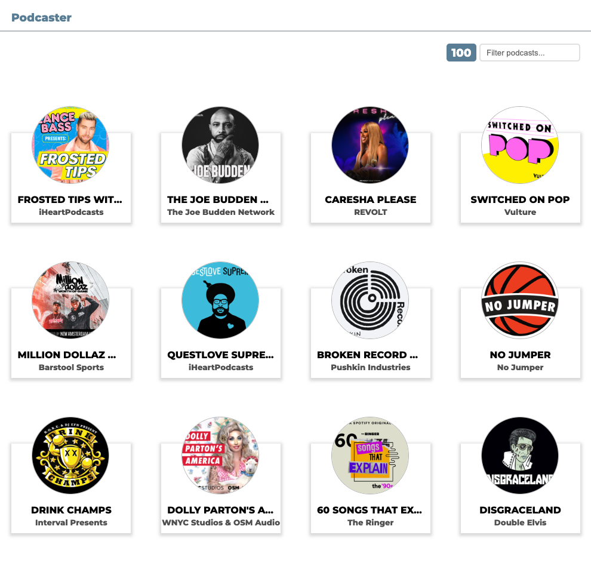
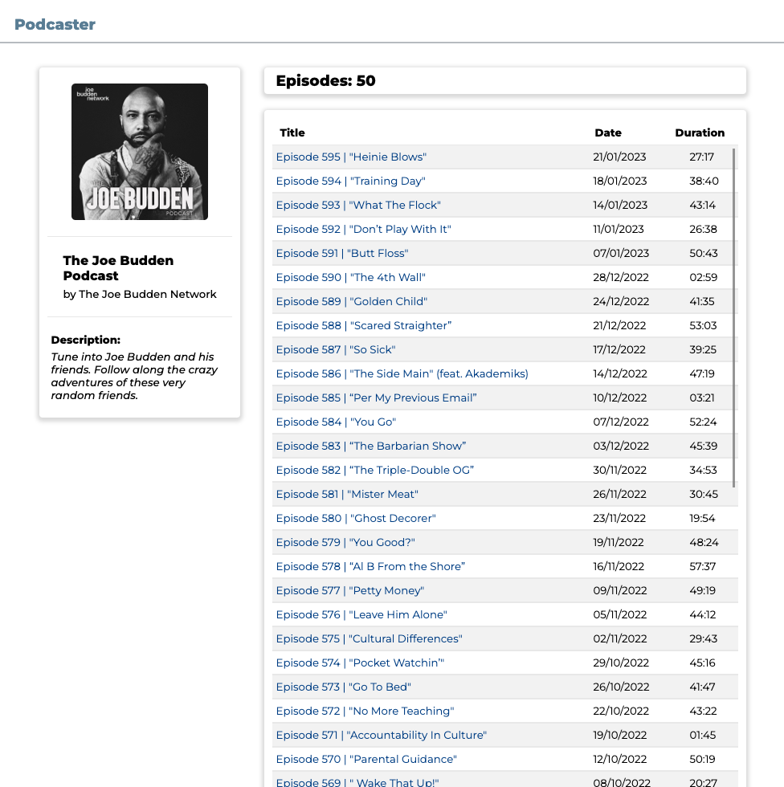
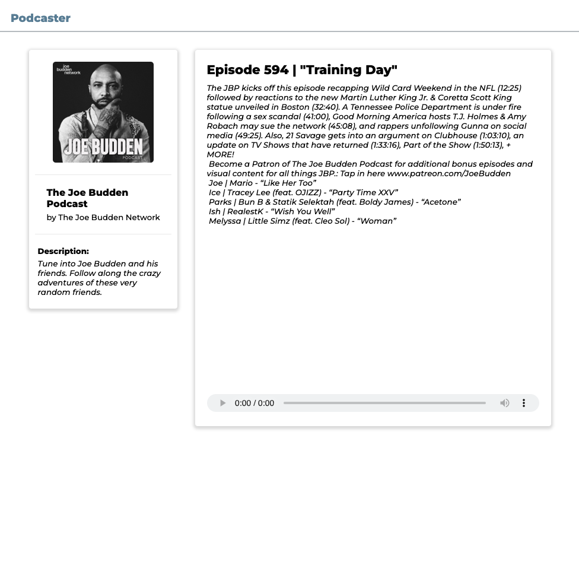
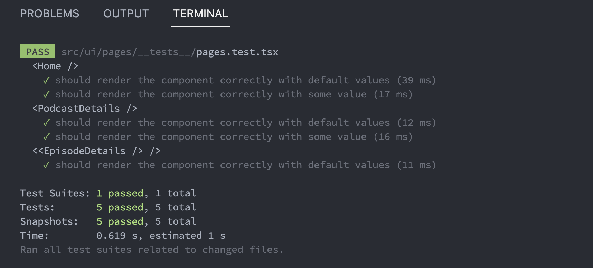

## Getting Started

First, run the development server:

```bash
npm run dev
# or
yarn dev
# or
pnpm dev
```

Open [http://localhost:3000](http://localhost:3000) with your browser to see the result.

Executing test:

```bash
npm run test
```

### Requirements

[npm](https://www.npmjs.com/) 📦 v8.x or greater
[node](https://www.nodejs.org/) 📦 v18.x or greater

It's recommended to install npm and node through [nvm - node version manager](https://github.com/nvm-sh/nvm#readme)

## 📌 Understanding the project folder structure

```bash
├── /pages                    # NextJS router for server
├── /src                      # All business logic and ui components
│   ├── /core                 # The CORE of hexagonal architecture for each domain and all the business logic
│   │   └── Itunes            # Itunes Domain
│   │   │   └── ...           # Hexagonal architecture
│   │   │   └── application   # Use cases
│   │   │   └── domain        # Domain definition
│   │   │   └── infra         # All external connections, like API, GraphQL, etc
│   │   │   │   └── mocks     # All external connections mocks
│   │   │   └── services      # Instances of use cases
│   │   └── types             # Reusable types
│   │   └── utils             # Reusable functions/helpers
│   └── /ui                   # UI components
│      └── components         # Global custom components
│      └── hooks              # Global custom hooks
│      └── pages              # UI of pages
│      └── sass               # Global sass
│      └── types              # Global types
│      └── utils              # Reusable functions/helpers for UIp
```

## The web page views

The whole website was made to be in 1024px. It wasn't done to mobile platform.

Home:



Podcast Detail:



Episode Detail:



Testing in terminal example:



## Learn More

To learn more about Next.js, take a look at the following resources:

- [Next.js Documentation](https://nextjs.org/docs) - learn about Next.js features and API.
- [Learn Next.js](https://nextjs.org/learn) - an interactive Next.js tutorial.

You can check out [the Next.js GitHub repository](https://github.com/vercel/next.js/) - your feedback and contributions are welcome!

## Deploy on Vercel

The easiest way to deploy your Next.js app is to use the [Vercel Platform](https://vercel.com/new?utm_medium=default-template&filter=next.js&utm_source=create-next-app&utm_campaign=create-next-app-readme) from the creators of Next.js.

Check out our [Next.js deployment documentation](https://nextjs.org/docs/deployment) for more details.
